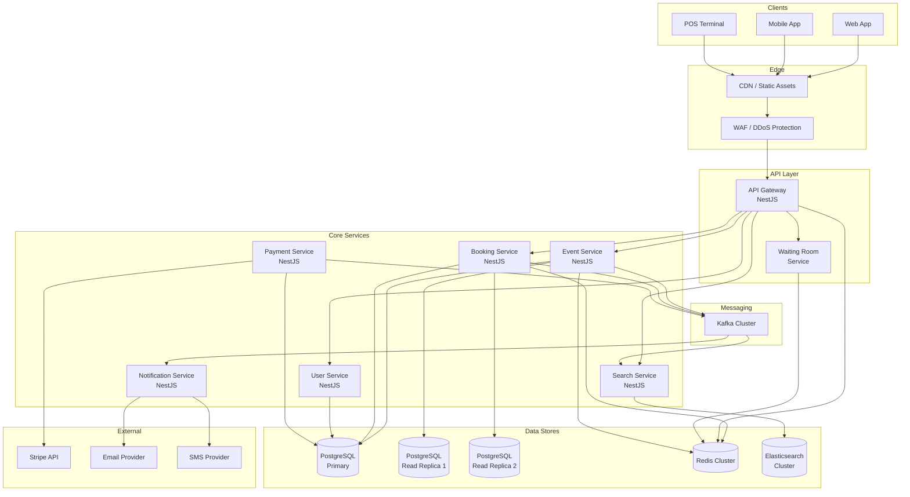

# Momentum -- Architecture Overview

## System Summary

Momentum is a distributed ticketing platform designed for 10 million concurrent users with a 100:1 read/write ratio. The architecture is microservice-based, event-driven, and optimized for extreme concurrency during peak on-sale events.

## System Diagram



## Service Boundaries

### API Gateway

| Attribute       | Value |
|-----------------|-------|
| **Responsibility** | Request routing, authentication, rate limiting, waiting room enforcement |
| **Technology**  | NestJS with Fastify adapter |
| **Scaling**     | Stateless; horizontally scaled via Kubernetes HPA |

The gateway is the single entry point for all client requests. It:

- Validates JWT tokens and attaches user context to the request.
- Enforces per-user and per-IP rate limits via `@nestjs/throttler` backed by Redis.
- Routes requests to the appropriate downstream service.
- Enforces the waiting room queue during high-demand on-sales (see anti-bot-and-fairness.md).
- Serves as the TLS termination point behind the load balancer.

### Event Service

| Attribute       | Value |
|-----------------|-------|
| **Responsibility** | Event CRUD, venue management, ticket inventory creation, pricing |
| **Data store**  | PostgreSQL (write to primary, read from replicas) |
| **Cache**       | Redis -- event details cached for 60s (invalidated on update) |
| **Events published** | `events.created`, `events.updated`, `events.cancelled` |

The event service owns the `events`, `venues`, `sections`, `ticket_types`, and `tickets` tables. When an event is created, it publishes to Kafka for downstream consumers (search indexer, notification service).

### Booking Service

| Attribute       | Value |
|-----------------|-------|
| **Responsibility** | Ticket reservation, booking confirmation, reservation expiry |
| **Data store**  | PostgreSQL primary (pessimistic locking on ticket rows) |
| **Cache/State** | Redis -- reservation TTLs, idempotency keys, distributed locks |
| **Events published** | `bookings.reserved`, `bookings.confirmed`, `bookings.expired`, `bookings.cancelled` |

The booking service implements the concurrency control strategy described in ADR-0004. It is the most write-intensive service and the primary target for horizontal scaling during on-sales.

### Search Service

| Attribute       | Value |
|-----------------|-------|
| **Responsibility** | Full-text search, autocomplete, faceted filtering |
| **Data store**  | Elasticsearch cluster |
| **Events consumed** | `events.created`, `events.updated`, `events.cancelled` |

The search service exposes read-only endpoints. It consumes Kafka events to keep its Elasticsearch index in sync with the event service. See search-architecture.md for details.

### Payment Service

| Attribute       | Value |
|-----------------|-------|
| **Responsibility** | Payment processing, Stripe integration, refunds |
| **Data store**  | PostgreSQL primary (payment records, transaction log) |
| **Events published** | `payments.completed`, `payments.failed`, `payments.refunded` |
| **External**    | Stripe API |

The payment service is a thin adapter around Stripe. It creates PaymentIntents, handles Stripe webhooks, and publishes payment events. It does not store card details.

### Notification Service

| Attribute       | Value |
|-----------------|-------|
| **Responsibility** | Email, SMS, push notifications |
| **Events consumed** | `bookings.confirmed`, `bookings.cancelled`, `events.updated` |
| **External**    | Email provider (SES/SendGrid), SMS provider (Twilio) |

The notification service is a pure consumer. It has no API endpoints exposed to clients.

### User Service

| Attribute       | Value |
|-----------------|-------|
| **Responsibility** | User registration, authentication, profile management |
| **Data store**  | PostgreSQL primary |
| **Auth**        | Issues and validates JWT tokens |

## Data Stores

### PostgreSQL (Primary + Read Replicas)

- **Primary**: Single writer instance handling all write operations. Connection pooling via PgBouncer.
- **Read Replicas**: 2+ streaming replicas for read-heavy operations (event listings, user profiles, booking history). Replication lag monitored; reads that require strong consistency go to the primary.
- **Connection pooling**: PgBouncer in transaction mode; pool size tuned per service based on expected concurrency.
- **Backups**: Continuous WAL archiving to S3; point-in-time recovery capability.

### Redis Cluster

- **Mode**: Redis Cluster with 6+ nodes (3 masters, 3 replicas) across availability zones.
- **Use cases**:
  - Response caching (event details, search results) with TTL-based invalidation.
  - Reservation TTLs (7-minute keys with keyspace notifications).
  - Distributed rate limiting (sliding window counters).
  - Idempotency key storage (1-hour TTL).
  - Waiting room queue tokens.
  - Distributed locks (Redlock algorithm for critical sections).
- **Persistence**: AOF enabled with `appendfsync everysec` for durability without significant performance impact.

### Elasticsearch Cluster

- **Topology**: 3 dedicated master-eligible nodes, 3+ data nodes, 2 coordinating nodes.
- **Indexes**: `events` (primary search index with Portuguese analyzers), `venues`, `artists`.
- **Replication**: 1 replica per shard; cross-AZ allocation awareness.
- **See**: search-architecture.md for mapping details and indexing pipeline.

## Asynchronous Communication

### Kafka for Event Propagation

All cross-service state changes are propagated via Kafka. The system uses the **transactional outbox pattern** to ensure events are published reliably:

1. Within the database transaction that creates/updates a record, a row is inserted into the `outbox` table.
2. A dedicated outbox poller (running on a short interval) reads unpublished outbox rows and publishes them to Kafka.
3. After successful publish, the outbox row is marked as published.

```sql
CREATE TABLE outbox (
    id UUID PRIMARY KEY DEFAULT gen_random_uuid(),
    aggregate_type VARCHAR(100) NOT NULL,    -- e.g., 'Event', 'Booking'
    aggregate_id UUID NOT NULL,
    event_type VARCHAR(100) NOT NULL,        -- e.g., 'events.created'
    payload JSONB NOT NULL,
    published BOOLEAN NOT NULL DEFAULT FALSE,
    created_at TIMESTAMPTZ NOT NULL DEFAULT NOW(),
    published_at TIMESTAMPTZ
);

CREATE INDEX idx_outbox_unpublished ON outbox (created_at) WHERE published = FALSE;
```

This pattern guarantees that if the database transaction commits, the event will eventually be published -- even if the application crashes between the commit and the Kafka publish.

### Kafka Cluster Topology

- **Brokers**: 3+ brokers using KRaft (no ZooKeeper dependency).
- **Replication factor**: 3 for all production topics.
- **Min in-sync replicas**: 2 (ensures durability even if one broker is unavailable).
- **Partition strategy**: See scaling-assumptions.md.

## Synchronous Communication

### HTTP Between Gateway and Services

The API Gateway communicates with downstream services over HTTP (internal network). Service discovery is handled by Kubernetes DNS:

```
http://event-service.momentum.svc.cluster.local:3000/api/v1/events
http://booking-service.momentum.svc.cluster.local:3001/api/v1/reservations
http://search-service.momentum.svc.cluster.local:3002/api/v1/search
```

- **Timeouts**: 5s default; 15s for booking operations.
- **Retries**: 1 retry with exponential backoff for idempotent GET requests; no retry for POST/PUT (idempotency key handles client retries).
- **Circuit breaker**: Implemented via `@nestjs/terminus` health checks and a circuit breaker pattern in the gateway. If a downstream service fails 5 consecutive health checks, the circuit opens and requests are rejected immediately with a `503`.

## Authentication

### JWT Tokens

- **Issuer**: User Service.
- **Algorithm**: RS256 (asymmetric -- services validate with public key only).
- **Access token TTL**: 15 minutes.
- **Refresh token TTL**: 7 days (stored in Redis, revocable).
- **Claims**: `sub` (user ID), `email`, `roles`, `iat`, `exp`.
- **Validation**: API Gateway validates the token on every request and forwards the decoded claims as headers to downstream services.

## Deployment

### Docker + Kubernetes

- **Container images**: Each service has its own Dockerfile with multi-stage builds (build + production stages).
- **Orchestration**: Kubernetes with namespaces per environment (`momentum-dev`, `momentum-staging`, `momentum-prod`).
- **Scaling**: Horizontal Pod Autoscaler (HPA) based on CPU utilization (target 70%) and custom metrics (request rate, Kafka consumer lag).
- **Ingress**: NGINX Ingress Controller with TLS termination.
- **Secrets**: Kubernetes Secrets mounted as environment variables; sensitive values managed via external secrets operator (AWS Secrets Manager or HashiCorp Vault).
- **CI/CD**: GitHub Actions for build/test/push; ArgoCD for GitOps-based deployment.

### High Availability Topology

```
Region: sa-east-1 (Sao Paulo)
├── AZ-a
│   ├── API Gateway (2 pods)
│   ├── Event Service (2 pods)
│   ├── Booking Service (3 pods)
│   ├── Search Service (2 pods)
│   ├── PostgreSQL Primary
│   ├── Redis Master x2
│   ├── Elasticsearch Data Node x1
│   ├── Elasticsearch Master Node x1
│   └── Kafka Broker x1
├── AZ-b
│   ├── API Gateway (2 pods)
│   ├── Event Service (2 pods)
│   ├── Booking Service (3 pods)
│   ├── Search Service (2 pods)
│   ├── PostgreSQL Read Replica
│   ├── Redis Master x1, Replica x2
│   ├── Elasticsearch Data Node x1
│   ├── Elasticsearch Master Node x1
│   └── Kafka Broker x1
└── AZ-c
    ├── API Gateway (2 pods)
    ├── Event Service (1 pod)
    ├── Booking Service (2 pods)
    ├── Search Service (1 pod)
    ├── PostgreSQL Read Replica
    ├── Redis Replica x1
    ├── Elasticsearch Data Node x1
    ├── Elasticsearch Master Node x1
    └── Kafka Broker x1
```

- **Pod disruption budgets** ensure at least 50% of pods remain available during rolling deployments.
- **Anti-affinity rules** prevent multiple pods of the same service from running on the same node.
- **Resource requests and limits** are defined per service based on load testing results.

## Cross-Cutting Concerns

### Observability

- **Metrics**: Prometheus + Grafana. Each NestJS service exposes `/metrics` via `prom-client`.
- **Logging**: Structured JSON logs (Pino) shipped to Elasticsearch via Fluentd/Fluent Bit.
- **Tracing**: OpenTelemetry with Jaeger for distributed tracing across services.
- **Alerting**: Grafana alerting with PagerDuty integration for P1/P2 incidents.

### API Versioning

- URL-based versioning: `/api/v1/events`, `/api/v2/events`.
- Breaking changes require a new version; backward-compatible changes are added to the current version.

### Error Handling

- Standardized error response format across all services:

```json
{
  "statusCode": 409,
  "error": "Conflict",
  "message": "Ticket is no longer available",
  "code": "TICKET_UNAVAILABLE",
  "timestamp": "2026-04-06T12:00:00.000Z",
  "requestId": "req_abc123"
}
```

## Related Documents

- [ADR-0001: Stack Selection](../adr/0001-stack-selection.md)
- [ADR-0002: Search Engine](../adr/0002-search-engine.md)
- [ADR-0003: Message Broker](../adr/0003-message-broker.md)
- [ADR-0004: Concurrency Strategy](../adr/0004-concurrency-strategy.md)
- [Booking Consistency Strategy](./booking-consistency-strategy.md)
- [Search Architecture](./search-architecture.md)
- [Anti-Bot and Fairness](./anti-bot-and-fairness.md)
- [Scaling Assumptions](./scaling-assumptions.md)
- [Operational Runbook](../runbooks/operational-runbook.md)
