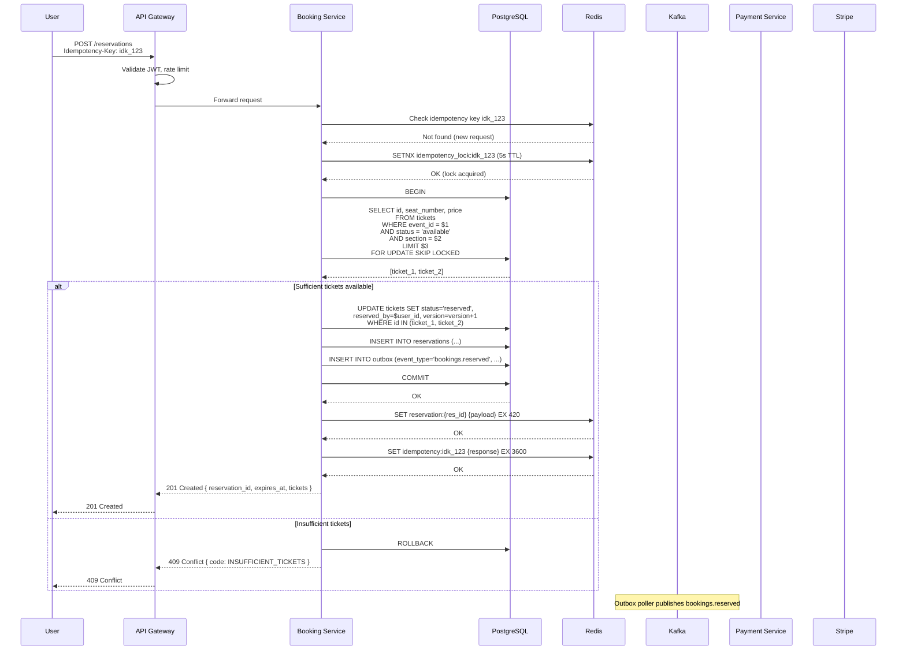
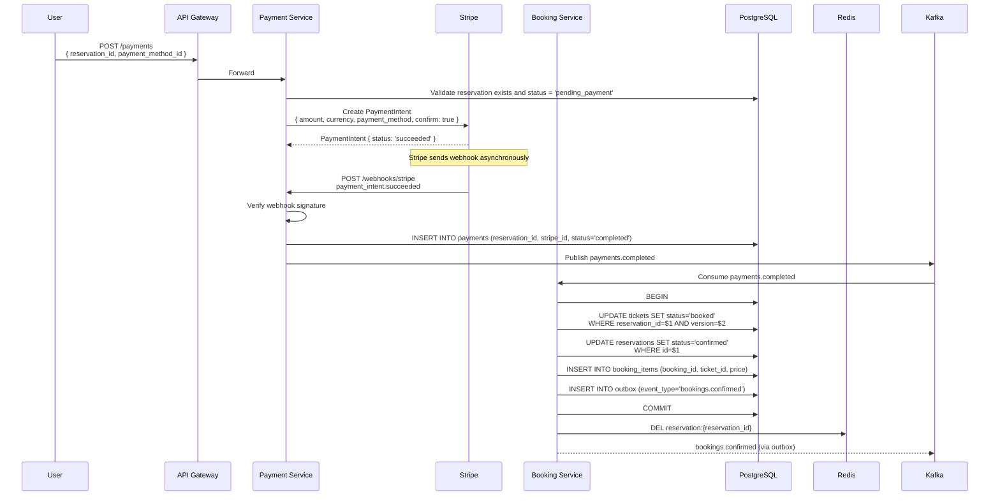
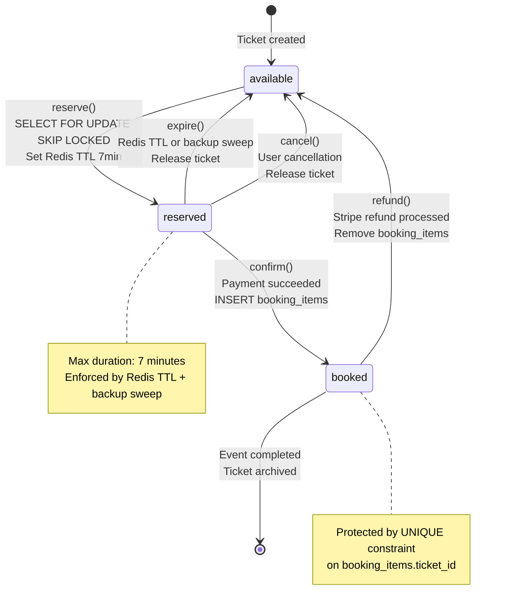

# Momentum -- Booking Consistency Strategy

## Overview

This document details the end-to-end booking flow, from ticket reservation through payment confirmation and expiry handling. It implements the concurrency control strategy defined in ADR-0004.

## Reservation Flow

### Step-by-Step Sequence



### Step Details

**Step 1: Request Arrival**

The client sends a `POST /api/v1/reservations` request with:
- `event_id`: the event to book.
- `section`: the desired section (e.g., "VIP", "General").
- `quantity`: number of tickets requested (max 6 per user per event).
- `Idempotency-Key` header: client-generated unique key.

**Step 2: Idempotency Check**

The booking service checks Redis for the idempotency key. If found, the stored response is returned immediately without re-processing. If not found, an atomic lock (`SETNX`) is acquired to prevent concurrent processing of the same key.

**Step 3: Pessimistic Lock Acquisition**

```sql
SELECT id, seat_number, section, price
FROM tickets
WHERE event_id = $1
  AND status = 'available'
  AND section = $2
ORDER BY seat_number
LIMIT $3
FOR UPDATE SKIP LOCKED;
```

Key behaviors:
- `FOR UPDATE` acquires a row-level exclusive lock on each returned row.
- `SKIP LOCKED` silently excludes rows locked by other transactions, preventing blocking.
- `ORDER BY seat_number` ensures deterministic seat assignment (adjacent seats when possible).
- `LIMIT $3` restricts to the requested quantity.

If the number of returned rows is less than the requested quantity, the transaction is rolled back and the user is informed.

**Step 4: Status Update**

```sql
UPDATE tickets
SET status = 'reserved',
    reserved_by = $user_id,
    reserved_at = NOW(),
    reservation_id = $reservation_id,
    version = version + 1
WHERE id = ANY($ticket_ids);
```

The `version` column is incremented for optimistic concurrency in subsequent operations.

**Step 5: Reservation Record**

```sql
INSERT INTO reservations (
    id, user_id, event_id, status, ticket_count,
    total_price, expires_at, idempotency_key, created_at
) VALUES (
    $1, $2, $3, 'pending_payment', $4, $5,
    NOW() + INTERVAL '7 minutes', $6, NOW()
);
```

**Step 6: Outbox Event**

Within the same transaction, an outbox row is inserted:

```sql
INSERT INTO outbox (
    aggregate_type, aggregate_id, event_type, payload
) VALUES (
    'Reservation', $reservation_id, 'bookings.reserved',
    '{"reservation_id": "...", "user_id": "...", "tickets": [...]}'
);
```

**Step 7: Redis TTL Key**

After the transaction commits, a Redis key is set:

```
SET reservation:{reservation_id} {serialized_payload} EX 420
```

The 420-second (7-minute) TTL starts the countdown for payment completion.

**Step 8: Response**

The response includes the reservation ID, a list of reserved tickets, the total price, and the `expires_at` timestamp. The client uses this to display a countdown timer and initiate payment.

## SELECT FOR UPDATE SKIP LOCKED -- Detailed Behavior

### Concurrency Scenario

Consider 3 concurrent users requesting 2 tickets each from a section with 5 available tickets:

```
Time   | Transaction A          | Transaction B          | Transaction C
-------|------------------------|------------------------|------------------------
T1     | BEGIN                  | BEGIN                  | BEGIN
T2     | SELECT ... SKIP LOCKED | SELECT ... SKIP LOCKED | SELECT ... SKIP LOCKED
       | Gets: ticket_1, _2    | Gets: ticket_3, _4    | Gets: ticket_5 (only 1)
T3     | UPDATE status=reserved | UPDATE status=reserved | ROLLBACK (insufficient)
T4     | COMMIT                 | COMMIT                 | Return 409
```

- Transaction A locks tickets 1 and 2.
- Transaction B, running concurrently, skips locked rows and gets tickets 3 and 4.
- Transaction C skips all 4 locked rows, finds only 1 available ticket, and rolls back.

No transaction blocks. No deadlocks. Maximum throughput.

### Edge Case: All Tickets Locked

If all available tickets are locked by concurrent transactions, `SKIP LOCKED` returns an empty result set. The service returns a `409 Conflict` with code `TICKETS_TEMPORARILY_UNAVAILABLE`. The client can retry after a short delay (some of the locked tickets may be released if those transactions fail).

## Payment Flow with Stripe Webhook



### Payment Confirmation Steps

1. **PaymentIntent creation**: The payment service creates a Stripe PaymentIntent with `confirm: true` for immediate charge.
2. **Webhook verification**: The Stripe webhook signature is verified using the signing secret to prevent forgery.
3. **Payment record**: A payment record is created in PostgreSQL with the Stripe PaymentIntent ID for reconciliation.
4. **Booking confirmation**: The booking service consumes the `payments.completed` event and:
   - Updates ticket status from `reserved` to `booked` with version check.
   - Updates reservation status to `confirmed`.
   - Inserts `booking_items` rows (the `UNIQUE(ticket_id)` constraint is the final double-booking safety net).
   - Inserts an outbox row for `bookings.confirmed`.
5. **Redis cleanup**: The reservation TTL key is deleted (it is no longer needed since the tickets are now booked).

### Payment Failure

If the PaymentIntent fails:
- Stripe sends a `payment_intent.payment_failed` webhook.
- The payment service publishes `payments.failed` to Kafka.
- The booking service releases the reservation (same as TTL expiry).
- The user receives a notification and can retry with a different payment method.

## Expiry Handling

### Primary: Redis Keyspace Notifications

```typescript
@Injectable()
export class ReservationExpiryHandler implements OnModuleInit {
  private subscriber: Redis;

  async onModuleInit(): Promise<void> {
    this.subscriber = new Redis(this.configService.get('REDIS_URL'));

    // Enable keyspace notifications for expired events
    await this.subscriber.config('SET', 'notify-keyspace-events', 'Ex');

    // Subscribe to expiry events on database 0
    await this.subscriber.subscribe('__keyevent@0__:expired');

    this.subscriber.on('message', (channel, key) => {
      if (key.startsWith('reservation:')) {
        const reservationId = key.split(':')[1];
        this.handleExpiry(reservationId);
      }
    });
  }

  private async handleExpiry(reservationId: string): Promise<void> {
    await this.bookingService.releaseReservation(reservationId, 'ttl_expired');
  }
}
```

### Backup: Scheduled Sweep

```typescript
@Injectable()
export class ReservationSweepJob {
  private readonly logger = new Logger(ReservationSweepJob.name);

  @Cron('*/60 * * * * *') // Every 60 seconds
  async sweep(): Promise<void> {
    const cutoff = new Date(Date.now() - 7 * 60 * 1000);

    const staleReservations = await this.reservationRepository.find({
      where: {
        status: 'pending_payment',
        createdAt: LessThan(cutoff),
      },
    });

    for (const reservation of staleReservations) {
      try {
        await this.bookingService.releaseReservation(reservation.id, 'backup_sweep');
        this.logger.log(`Released stale reservation ${reservation.id}`);
      } catch (error) {
        this.logger.error(`Failed to release reservation ${reservation.id}`, error.stack);
      }
    }

    if (staleReservations.length > 0) {
      this.logger.warn(`Backup sweep released ${staleReservations.length} stale reservations`);
    }
  }
}
```

### Release Operation

The `releaseReservation` method is idempotent and safe against race conditions:

```typescript
async releaseReservation(reservationId: string, reason: string): Promise<void> {
  await this.dataSource.transaction(async (manager) => {
    // Lock the reservation row to prevent concurrent release
    const reservation = await manager.findOne(Reservation, {
      where: { id: reservationId },
      lock: { mode: 'pessimistic_write' },
    });

    if (!reservation || reservation.status !== 'pending_payment') {
      // Already confirmed, already released, or does not exist -- no-op
      return;
    }

    // Release tickets
    await manager.update(Ticket, {
      reservationId: reservationId,
      status: 'reserved',
    }, {
      status: 'available',
      reservedBy: null,
      reservedAt: null,
      reservationId: null,
      version: () => 'version + 1',
    });

    // Update reservation status
    await manager.update(Reservation, { id: reservationId }, {
      status: 'expired',
      expiredAt: new Date(),
      expiryReason: reason,
    });

    // Outbox event
    await manager.insert(Outbox, {
      aggregateType: 'Reservation',
      aggregateId: reservationId,
      eventType: 'bookings.expired',
      payload: { reservation_id: reservationId, reason },
    });
  });

  // Clean up Redis (may already be expired)
  await this.redis.del(`reservation:${reservationId}`);
}
```

## Idempotency Implementation

### Request Flow

```
Client Request
    │
    ▼
┌─────────────────────────┐
│ Check Redis:             │
│ idempotency:{key}        │
│                          │
│ Found? ──► Return cached │
│            response      │
│                          │
│ Not found? ──► Continue  │
└─────────────┬───────────┘
              │
              ▼
┌─────────────────────────┐
│ Acquire lock:            │
│ SETNX idempotency_lock:  │
│ {key} (5s TTL)           │
│                          │
│ Failed? ──► 409 Conflict │
│             (in-flight)  │
│                          │
│ Success? ──► Process     │
└─────────────┬───────────┘
              │
              ▼
┌─────────────────────────┐
│ Process request          │
│                          │
│ On success:              │
│   SET idempotency:{key}  │
│   {response} EX 3600     │
│                          │
│ On failure:              │
│   DEL idempotency_lock:  │
│   {key}                  │
└─────────────────────────┘
```

### Guard Implementation

```typescript
@Injectable()
export class IdempotencyGuard implements CanActivate {
  constructor(private readonly redis: RedisService) {}

  async canActivate(context: ExecutionContext): Promise<boolean> {
    const request = context.switchToHttp().getRequest();
    const key = request.headers['idempotency-key'];

    if (!key) {
      throw new BadRequestException('Idempotency-Key header is required');
    }

    // Check for cached response
    const cached = await this.redis.get(`idempotency:${key}`);
    if (cached) {
      const response = JSON.parse(cached);
      const res = context.switchToHttp().getResponse();
      res.status(response.statusCode).json(response.body);
      return false;
    }

    // Acquire processing lock
    const lockAcquired = await this.redis.set(
      `idempotency_lock:${key}`,
      '1',
      'EX', 5,
      'NX',
    );

    if (!lockAcquired) {
      throw new ConflictException('Request with this idempotency key is already being processed');
    }

    return true;
  }
}
```

## State Machine Diagram



## Consistency Guarantees Summary

| Guarantee | Mechanism | Failure Mode | Recovery |
|-----------|-----------|--------------|----------|
| No double-booking | UNIQUE(ticket_id) on booking_items | Constraint violation | 409 returned to client |
| No double-reservation | SELECT FOR UPDATE SKIP LOCKED | None (database-enforced) | N/A |
| No duplicate processing | Idempotency keys in Redis | Redis unavailable | Lock acquisition fails; client retries |
| Reservation expiry | Redis TTL + backup sweep | Keyspace notification missed | Backup sweep catches within 60s |
| Atomic state transitions | PostgreSQL transactions | Transaction rollback | Client retries with same idempotency key |
| Event publication | Outbox pattern | App crash after commit | Outbox poller retries unpublished rows |

## Related Documents

- [ADR-0004: Concurrency Strategy](../adr/0004-concurrency-strategy.md)
- [Architecture Overview](./architecture-overview.md)
- [Anti-Bot and Fairness](./anti-bot-and-fairness.md)
